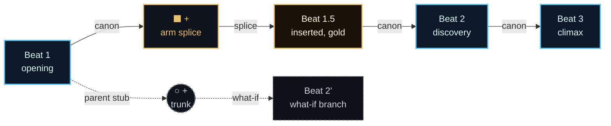
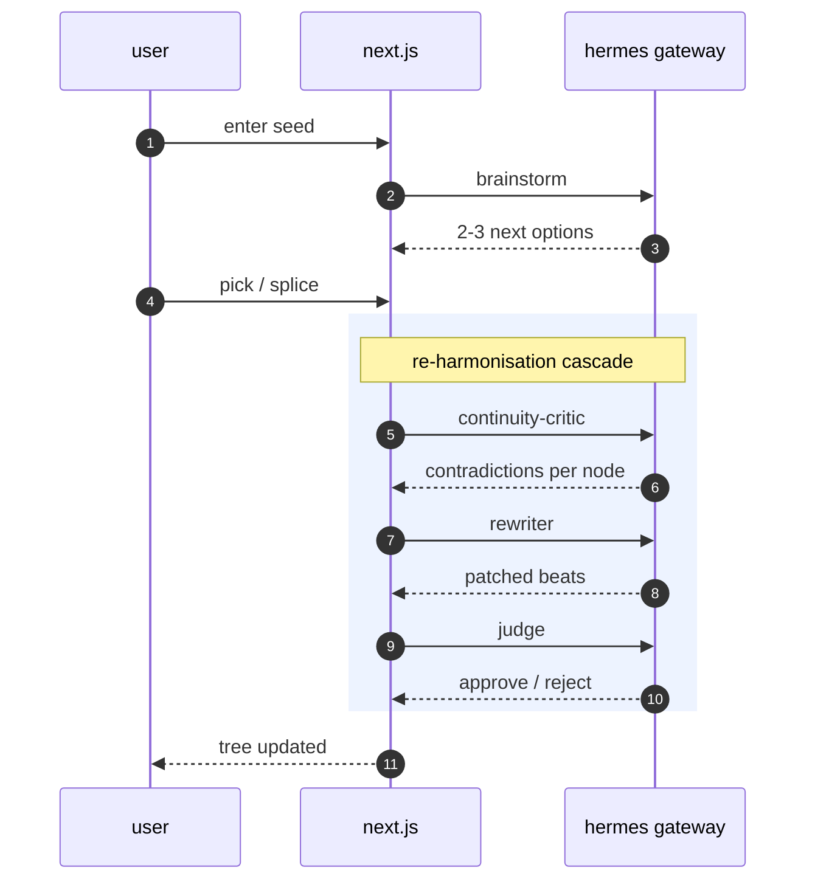
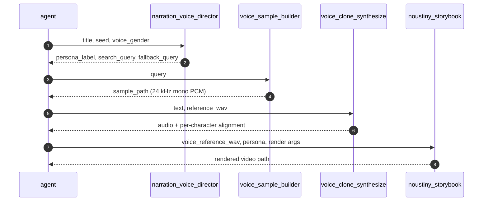
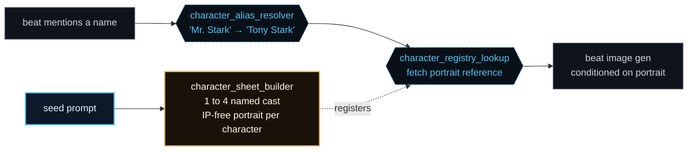
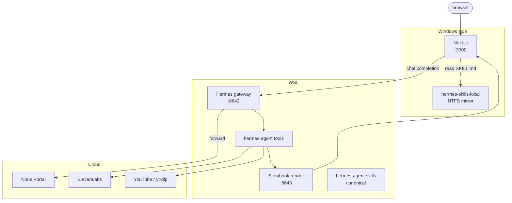

<h1 align="center">Noustiny</h1>

<p align="center"><em>Drop a seed. Walk a universe.</em></p>

<p align="center">
  
  
  
  
  
</p>

---

> **The stories you keep imagining. See them, hear them, share them.**

You don't ask for *a* story. You drop a seed and walk every "what if"
branch the universe could take. Every splice becomes a real branch: the
agent re-harmonises the canon, paints the visuals, clones a fitting
narrator voice, and renders the version you picked into a video you can
post.

<p align="center">
  
  
</p>

## At a glance

| Action                    | Result                                                         |
| :------------------------ | :------------------------------------------------------------- |
| Type a seed               | A canon-tracked, live branching story canvas                   |
| Pick an option            | Hermes proposes the next 2 to 3 critical beats                 |
| Splice a beat mid-tree    | Downstream beats re-harmonise themselves automatically         |
| Hit Render                | A landscape audiobook or a vertical reel, ready to post        |
| Drop a YouTube URL        | ElevenLabs IVC clones that voice for every line of narration   |
| Save / Load               | Full tree state, with provenance, in localStorage              |

## How it works

Two distinct loops sit under the canvas. The **authoring loop** runs per
beat as you grow the tree. The **render loop** runs once, when you press
Render: the agent dispatches four registered Hermes tools in sequence on
a single chat completion, no app-side orchestration.

### Two ways to fork the story

The canvas exposes two `+` buttons with different shapes and different
jobs. Both grow the tree, but only one of them needs the council.



| Gesture | Where it sits | What it does |
| :--- | :--- | :--- |
| **Square +** (gold, parallelogram) | Midpoint between a parent and its canon child | Splices a new beat *into* the canon. `narrative-writer-assist` drafts the inserted beat, then the council cascade patches every downstream beat the splice made stale. |
| **Round +** (dashed circle) | Off the parent's outgoing stub | Adds a what-if sibling, a parallel timeline that doesn't touch existing canon. No cascade fires; brainstorm just produces 3 fresh next options on this new branch. |

### Authoring loop: per-beat council

Every beat passes through a small council of narrative skills. Splice one
beat and the cascade walks downstream by itself until the canon is coherent
again.



### Render loop: autonomous tool chain

When you press Render, the agent chains four registered Hermes tools in
sequence on a single chat completion. No app-side glue.



### Character continuity: one face per character

Stories drift visually when "Tony Stark", "Mr. Stark", and "Tony" each
get a different portrait. Noustiny pins the cast at seed time and threads
the same reference image through every beat that mentions them.



The cast sheet is built once. From then on, every beat that names a
character pulls the same portrait reference, so a face stays a face across
the whole tree, including the rendered video.

## Tools

12 registered tool names across 10 Python files. Each one fills a primitive
Hermes did not ship with.

### Story state

| Tool                        | Purpose                                                                            |
| :-------------------------- | :--------------------------------------------------------------------------------- |
| `story_tree_graph`          | Tree graph operations: canon path, descendants, splice insertion points            |
| `narrative_context_builder` | Walks the canon chain, returns the live structured context every skill reads from  |
| `motif_tracker`             | Recurring motif memory across the arc (a sword in beat 2 must reappear later)      |

### Character continuity

| Tool                        | Purpose                                                                            |
| :-------------------------- | :--------------------------------------------------------------------------------- |
| `story_copyright_detector`  | IP scrub: "Iron Man" becomes an IP-free description before the image API sees it   |
| `character_sheet_builder`   | Produces 1 to 4 named characters with IP-free visuals plus portrait prompts        |
| `character_registry_lookup` | Find a character on the cast sheet, attach the correct portrait reference          |
| `character_alias_resolver`  | "Mr. Stark" resolves to "Tony Stark" so one character keeps one portrait           |

### Voice

| Tool                        | Purpose                                                                            |
| :-------------------------- | :--------------------------------------------------------------------------------- |
| `narration_voice_director`  | Director-agent reads seed and story, returns persona plus reference search query   |
| `voice_sample_builder`      | yt-dlp + ffmpeg, accepts URL, 11-char ID, or free text. Normalises to 24 kHz mono  |
| `voice_clone_synthesize`    | ElevenLabs IVC + with-timestamps. Voice cached by reference SHA. Alignment is free |
| `voice_clone_cleanup`       | Frees the cached voice ID after render                                             |

### Render

| Tool                        | Purpose                                                                            |
| :-------------------------- | :--------------------------------------------------------------------------------- |
| `noustiny_storybook`        | Render entry. Agent dispatches it; one call drives the FastAPI service end to end  |

## Skills

13 agentskills.io bundles, each one a system prompt for a single creative
concern. Next reads them from the local mirror and sends them as the
system role on every chat completion; the autonomous storybook chain pulls
its own from the gateway side.

### Tree authoring

| Skill                         | Role                                                              |
| :---------------------------- | :---------------------------------------------------------------- |
| `narrative-brainstorm`        | Proposes 2 to 3 next-checkpoint options from the canon chain      |
| `narrative-writer-assist`     | Writes a spliced insert beat that fits parent and child           |
| `narrative-continuity-critic` | Audits downstream beats against any insert                        |
| `narrative-rewriter`          | Patches the stale beats the critic flagged                        |
| `narrative-judge`             | Approves or rejects the rewrite against the original              |
| `narrative-scene-qa`          | Per-beat sanity check (consistency, length, register)             |
| `narrative-writer`            | Seals the chosen branch as final prose                            |

### Visual + IP

| Skill                       | Role                                                              |
| :-------------------------- | :---------------------------------------------------------------- |
| `story-copyright-detector`  | Skill counterpart of the same-named tool                          |
| `character-sheet-builder`   | Cast extraction rules + IP-free portrait prompt format            |
| `visual-prompt-builder`     | Turns a beat into an IP-free image prompt; reads character sheet  |
| `scene-composition`         | Shot framing and layout rules                                     |
| `storybook-intro`           | Cinematic intro page generator                                    |

### Voice

| Skill                      | Role                                                               |
| :------------------------- | :----------------------------------------------------------------- |
| `narration-voice-director` | Persona reasoning rules backing the same-named tool                |

## Architecture



The `hermes-skills-local` directory is a Windows-side mirror of the canonical
skills folder in WSL. Reading SKILL.md over UNC stalls under parallel reads
(25 second timeouts on canvas-enter), so Next reads from local NTFS instead.
Resync after editing a SKILL.md:

```bash
cp -r //wsl.localhost/Ubuntu/home/<user>/hermes-agent/skills/creative \
      ./hermes-skills-local/
```

## Repo layout

```
.
├── hermes-additions/          tools + skills we authored for Hermes
│   ├── tools/                 10 .py files, 12 registered tool names
│   ├── skills/creative/       13 SKILL.md bundles
│   └── README.md              install + integration notes
├── hermes-skills-local/       Windows mirror (gitignored)
└── web/                       Next.js 16 app
    ├── app/                   routes, pages, layouts
    ├── components/            canvas, modals, agent ticker, etc.
    ├── lib/                   store, hermes client, save system
    └── public/                static assets
```

## Production-readiness spec

Spec-driven rollout artifacts live under:

- `docs/production/roadmap.md`
- `docs/production/spec/production-spec.json`
- `web/tests/production-spec.test.mjs`

Validate production spec coverage:

```bash
cd web
npm run spec:validate
```

## Built for

Nous Creative Hackathon, 2026.

## Credits

Hermes Agent · Nous Research
ElevenLabs Instant Voice Cloning
yt-dlp
ffmpeg + libass
